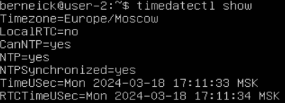

# Операционные системы UNIX/Linux (Базовый).

## Part 1. Установка ОС
**== Задание ==**

### Установить **Ubuntu 20.04 Server LTS** без графического интерфейса. (Используем программу для виртуализации - VirtualBox)
- Установил Ubuntu 20.04 Server LTS
- Узнал версию Ubuntu, выполнив команду \
`cat /etc/issue.`

## Part 2. Создание пользователя
**== Задание ==**

### Создать пользователя, отличного от пользователя, который создавался при установке. Пользователь должен быть добавлен в группу `adm`.

- Создаю нового пользователя командой `useradd`:
	- флаг -m - создание домашней директории,
	- флаг -d - устанавливает `/home/test-user` в качестве домашней директории,
	- флаг -g - добавляет пользователя в группу `adm`.

- Проверяю, что пользователь добавлен командой `cat /etc/passwd`

- Проверяю группы пользователя командой `groups`

## Part 3. Настройка сети ОС

**== Задание ==**

### Задать название машины вида user-1  

- Задаю название машины командой `hostnamectl set-hostname`

- Проверяю, что название изменено командой `hostnamectl status`

### Установить временную зону, соответствующую вашему текущему местоположению.  

- Ставлю временную зону командой `timedatectl set-timezone`

- Проверяю текущую временную зону командой `timedatectl`

### Вывести названия сетевых интерфейсов с помощью консольной команды.

- Вывожу название сетевых интерфейсов командой `ls sys/class/net`

	#### lo (loopback device) – виртуальный интерфейс, присутствующий по умолчанию в любом Linux. Он используется для отладки сетевых программ и запуска серверных приложений на локальной машине. С этим интерфейсом всегда связан адрес 127.0.0.1. У него есть dns-имя – localhost.

### Используя консольную команду получить ip адрес устройства, на котором вы работаете, от DHCP сервера. 

-  Получаю ip адрес командой `ip -br a`

	#### Протокол динамической конфигурации узлов (Dynamic Host Configuration Protocol, DHCP) — это сетевой протокол, используемый для автоматического получения узлами IP-адресов и сетевой конфигурации с сервера.

### Определить и вывести на экран внешний ip-адрес шлюза (ip) и внутренний IP-адрес шлюза, он же ip-адрес по умолчанию (gw). 

- Внешний ip-адрес можно узнать через специальные сайты, например командой `curl ifconfig.me`.
	

- Внутренний ip-адрес командой `ip route` и фильтруем командой `grep default`
	

### Задать статичные (заданные вручную, а не полученные от DHCP сервера) настройки ip, gw, dns (использовать публичный DNS серверы, например 1.1.1.1 или 8.8.8.8).

- Задаю статичные настройки редактированием файла
	
- Применение настроек
	

### Перезагрузить виртуальную машину. Убедиться, что статичные сетевые настройки (ip, gw, dns) соответствуют заданным в предыдущем пункте.

- После перезагрузки проверяю ip-адреса
	
	
- Проверяю пингом
	

## Part 4. Обновление ОС

**== Задание ==**

### Обновить системные пакеты до последней на момент выполнения задания версии. 

- Перед обновлением необходимо выполнить команду `apt-get update`, для обновления информации о пакетах.
	
- Теперь обновляем пакеты командой `apt-get dist-upgrade`. При повторном применении появиться сообщение, что обновления отсутствуют.
	

## Part 5. Использование команды **sudo**

**== Задание ==**

### Разрешить пользователю, созданному в [Part 2](#part-2-создание-пользователя), выполнять команду sudo.

- Добавляем пользователя в группу sudo
	
- Меняю hostname OC от имени пользователя
	

	#### Команда sudo предоставляет возможность пользователям выполнять команды от имени суперпользователя root, либо других пользователей

## Part 6. Установка и настройка службы времени

**== Задание ==**

##### Настроить службу автоматической синхронизации времени. 

Вывод время часового пояса, в котором сейчас находишься командой `timedatectl`
	
	

## Part 7. Установка и использование текстовых редакторов 

**== Задание ==**

### Установить текстовые редакторы **VIM** (+ любые два по желанию **NANO**, **MCEDIT**, **JOE** и т.д.) 

- Устанавливаю текстовые редакторы командой `apt-get install`
	
	
	

### Используя каждый из трех выбранных редакторов, создайте файл *test_X.txt*, где X -- название редактора, в котором создан файл. Напишите в нём свой никнейм, закройте файл с сохранением изменений. 

- Создаю и открываю файл на редактирование nano
	
-	Выхожу сочетанием клавиш ctrl+x, после предлагает сохранить
- Создаю и открываю файл на редактирование vim
	
- Для выхода ввожу `:wq`
- Создаю и открываю файл на редактирование mcedit
	
- Выхожу нажав клавишу Esc, перед выходом предлагает сохранить изменения

### Используя каждый из трех выбранных редакторов, откройте файл на редактирование, отредактируйте файл, заменив никнейм на строку "21 School 21", закройте файл без сохранения изменений.

- Выхожу сочетанием клавиш ctrl+x, при предложении сохранить отказываюсь
	
- Для выхода ввожу `:q!`
	
- Выхожу нажав клавишу Esc, при предложении сохранить отказываюсь
	

### Используя каждый из трех выбранных редакторов, отредактируйте файл ещё раз (по аналогии с предыдущим пунктом), а затем освойте функции поиска по содержимому файла (слово) и замены слова на любое другое.

- В vim ввожу :s/{pattern} для поиска
	
- :s/{pattern}/{string} для поиска и замены
	
- В nano нажимаю сочетание Alt+w для поиска
	
- сочетание Alt+r для поиска и замены
	
	
- В mcedit нажимаю F7 для поиска
	
- F4 для поиска и замены
	

## Part 8. Установка и базовая настройка сервиса **SSHD**

**== Задание ==**

##### Установить службу SSHd.

- Устанавливаю командой `apt install openssh-server`
	

### Добавить автостарт службы при загрузке системы. 

- Включаю автостарт `systemctl enable ssh`
	
- Убеждаюсь, что все работает
	

### Перенастроить службу SSHd на порт 2022.  

- Открываю конфигурационный файл на редактирование и прописываю нужный порт
	

### Используя команду ps, показать наличие процесса sshd. Для этого к команде нужно подобрать ключи.

- `ps -aux | grep sshd`

	
	ps-выводит список текущих процессов на вашем сервере в виде таблицы
	
	a-выбрать все процессы, кроме фоновых;
	
	u-выбрать процессы пользователя.
	
	x-заставляет ps перечислить все процессы, принадлежащие вам

### Перезагрузить систему.
- Вывод команды netstat -tan должен содержать  \
`tcp 0 0 0.0.0.0:2022 0.0.0.0:* LISTEN`  

	

	t- отабражение по протоколу TCP
	
	a-Отображение всех подключений и ожидающих портов.
	
	n- Отображение адресов и номеров портов в числовом формате.
	
	Cтолбцы:
	
	Recv-Q -количество запросов в очередях на приём на данном узле/компьютере
	
	Send-Q -количество запросов в очередях на отправку на данном узле/компьютере
	
	Local Address - адрес и номер локального конца сокета
	
	Foreign Address - адрес и номер порта удаленного порта сокета
	
	State - состояние сокета

	Если в качестве адреса отображается 0.0.0.0 , то это означает - "любой адрес", т. е в соединении могут использоваться все IP-адреса существующие на данном компьютере.

## Part 9. Установка и использование утилит **top**, **htop**

**== Задание ==**

### Установить и запустить утилиты top и htop.  

- Вывод команды **top**:
	
	- uptime - 31 min
  - количество авторизованных пользователей - 1
  - общую загрузку системы - load average: 0.00
  - общее количество процессов - 104
  - загрузку cpu - 0.0
  - загрузку памяти - 1971.4 total
  - pid процесса занимающего больше всего памяти - 741
		
  - pid процесса, занимающего больше всего процессорного времени - 741
		

- Вывод команды **htop**:
	- отсортированному по PID, PERCENT_CPU, PERCENT_MEM, TIME
		
		
		
		
  - отфильтрованному для процесса sshd
		
  - с процессом syslog, найденным, используя поиск 
		
  - с добавленным выводом hostname, clock и uptime  
		

## Part 10. Использование утилиты **fdisk**

**== Задание ==**

### Запустить команду fdisk -l.

- название жесткого диска - /dev/sda, 
- его размер - 18.1 GiB,
- количество секторов - 37956608, 
- swap - 1.9 GiB

	
	

## Part 11. Использование утилиты **df** 

**== Задание ==**

### Запустить команду df. 

- размер раздела - 10218772
- размер занятого пространства - 4724872
- размер свободного пространства - 4953228
- процент использования - 49%
- единицы измерения - килобайты

### Запустить команду df -Th.

- размер раздела - 9.8G
- размер занятого пространства - 4.6G
- размер свободного пространства - 4.8G
- процент использования - 49%
- тип файловой системы - ext4

## Part 12. Использование утилиты **du**

**== Задание ==**

### Запустить команду du.

### Вывести размер папок /home, /var, /var/log (в байтах, в человекочитаемом виде)

### Вывести размер всего содержимого в /var/log (не общее, а каждого вложенного элемента, используя *)

## Part 13. Установка и использование утилиты **ncdu**

**== Задание ==**

### Установить утилиту ncdu.

### Вывести размер папок /home, /var, /var/log.

## Part 14. Работа с системными журналами

**== Задание ==**

### Открыть для просмотра:
### 1. /var/log/dmesg

	- cat /var/log/dmesg

### 2. /var/log/syslog

	- cat /var/log/syslog

### 3. /var/log/auth.log 

	- cat /var/log/auth.log

- Mar 19 11:22:44 user-2 sudo: pam_unix(sudo:session): session opened for user root by berneick(uid=0)
- Время: 19 марта 11:22:44
- Имя: berneick
- Метод: pam_unix

## Part 15. Использование планировщика заданий **CRON**

**== Задание ==**

### Используя планировщик заданий, запустите команду uptime через каждые 2 минуты.

- Добавляю задание в файл `crontab -e`
	
	

- список текущих заданий для CRON `crontab -l`

	

### Удалите все задания из планировщика заданий.

- `crontab -r`
- `crontab -l`

	
